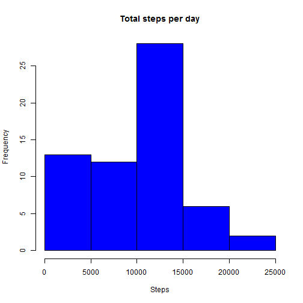
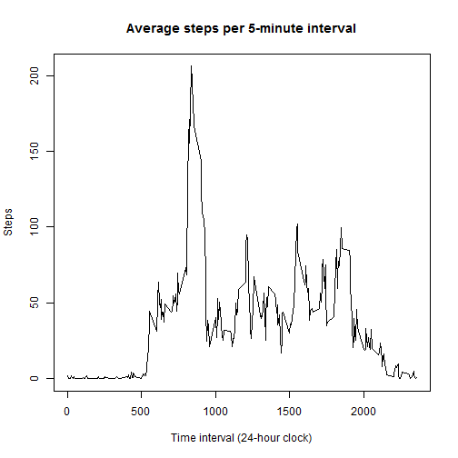
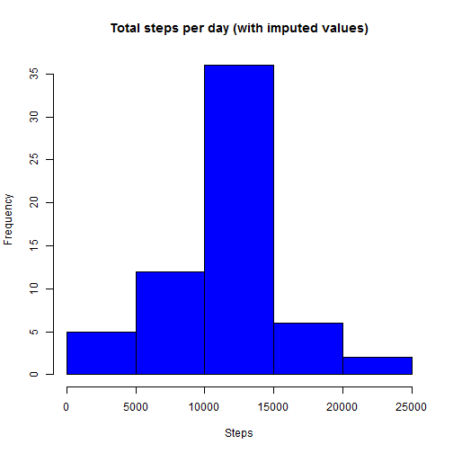
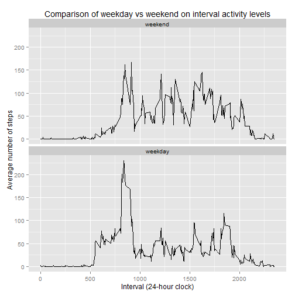

## Loading and preprocessing the data for Peer Assessment 1


```r
library(plyr) # Always useful...
library(chron) # Use for weekend detection
library(ggplot2) # For making the panel plot

# Source data is pulled directly from the data provided for the assignment.  To
# use the copy in the repo folder, just change the URL below to a file:// URL.
source_data_filename <- "https://d396qusza40orc.cloudfront.net/repdata%2Fdata%2Factivity.zip"
tempfn <- tempfile()
download.file(source_data_filename, tempfn, method="curl")
internalfns <- unzip(tempfn, list=TRUE)
con <- unz(tempfn, internalfns[[1]])
# Header and example line in the data file:
#    "steps","date","interval"
#    198,"2012-10-03",1710
# Interpretation:
#    steps is number of steps during the interval.
#    date is the date (YYYY-MM-DD) of the record.
#    interval is the start time of the 5-minute interval on a 24-hour clock (0-2355).
#    NA is used for missing values
rawdata <- read.csv(con, stringsAsFactors=FALSE, na.strings="NA",
                    colClasses=c("integer", "Date", "integer"))
unlink(tempfn)
```


## What is mean total number of steps taken per day?

```r
# Calculate some basic stats on the number of steps taken per day ignoring any
# missing values for now.  Zero will be listed for days where no steps were
# recorded.  Order the rows so that they are in date ascending order.
total_steps_per_day <- ddply(rawdata, "date", summarise,
                             total_steps=sum(steps, na.rm=TRUE))
raw_total_steps <- sum(rawdata$steps, na.rm=TRUE)
raw_mean_steps_per_day <- mean(total_steps_per_day$total_steps, na.rm=TRUE)
raw_median_steps_per_day <- median(total_steps_per_day$total_steps, na.rm=TRUE)
total_steps_per_day <- arrange(total_steps_per_day, date)


# Plot a histogram of the total number of steps taken each day
hist(total_steps_per_day$total_steps, col="blue", xlab="Steps",
     main="Total steps per day")
```

 

```r
# Report the mean and median of the total number of steps taken per day
cat(paste("Mean steps per day: ", raw_mean_steps_per_day, "\n",
          "Median steps per day: ", raw_median_steps_per_day, "\n", sep=""))
```

```
## Mean steps per day: 9354.22950819672
## Median steps per day: 10395
```


## What is the average daily activity pattern?

```r
# Determine the average daily activity pattern ignoring missing values for now.
interval_stats <- ddply(rawdata, "interval", summarise,
                        average_steps=mean(steps, na.rm=TRUE))
interval_stats <- arrange(interval_stats, interval)

# Make a time series plot of the 5-minute interval (x-axis) versus the
# average number of steps taken, averaged across all days (y-axis).
plot(interval_stats$interval, interval_stats$average_steps, type="l",
     xlab="Time interval (24-hour clock)", ylab="Steps",
     main="Average steps per 5-minute interval")
```

 

```r
# Report the 5-minute interval (as hh:mm) which has the maximum number of steps on average
max_avg_active_interval <- interval_stats[which.max(interval_stats$average_steps), "interval"]
cat(paste("The 5-minute interval which has the maximum number of steps on average is\n",
          sprintf("%04d which is %02d:%02d in the subject's local timezone.",
                  max_avg_active_interval, trunc(max_avg_active_interval/100),
                  max_avg_active_interval-(trunc(max_avg_active_interval/100)*100)), "\n",
          sep=""))
```

```
## The 5-minute interval which has the maximum number of steps on average is
## 0835 which is 08:35 in the subject's local timezone.
```


## Imputing missing values

```r
# Determine the number of records which were missing values
cat(paste("Number of records missing step values: ", nrow(rawdata)-sum(complete.cases(rawdata)),
          " (", (nrow(rawdata)-sum(complete.cases(rawdata)))/sum(complete.cases(rawdata))*100, "%)\n",
          sep=""))
```

```
## Number of records missing step values: 2304 (15.0943396226415%)
```

```r
# Impute values for the missing steps values.  For this analysis the average step count
# for the 5-minute interval is substituted in for missing values.
imputeddata <- merge(rawdata, interval_stats, by="interval", all.x=TRUE)
imputeddata[(is.na(imputeddata$steps)), "steps"] <- imputeddata[(is.na(imputeddata$steps)), "average_steps"]
imputeddata <- subset(imputeddata, select= -c(average_steps))
imputeddata <- arrange(imputeddata, date, interval)


# Calculate some basic stats on the number of steps taken per day based on
# the imputed data. Order the rows so that they are in date ascending order.
imputed_steps_per_day <- ddply(imputeddata, "date", summarise,
                               total_steps=sum(steps, na.rm=TRUE))
imputed_total_steps <- sum(imputeddata$steps, na.rm=TRUE)
imputed_mean_steps_per_day <- mean(imputed_steps_per_day$total_steps, na.rm=TRUE)
imputed_median_steps_per_day <- median(imputed_steps_per_day$total_steps, na.rm=TRUE)
imputed_steps_per_day <- arrange(imputed_steps_per_day, date)

# Plot a histogram of the total number of steps taken each day
hist(imputed_steps_per_day$total_steps, col="blue", xlab="Steps",
     main="Total steps per day (with imputed values)")
```

 

```r
# Report the mean and median of the total number of steps taken per day
cat(paste("Mean steps per day: ", imputed_mean_steps_per_day, "\n",
          "Median steps per day: ", imputed_median_steps_per_day, "\n",
    sep=""))
```

```
## Mean steps per day: 10766.1886792453
## Median steps per day: 10766.1886792453
```

```r
# Compare the daily mean and median values for the raw and imputed datasets.
# "Same" means there was no change.  "Increased" means that steps increased by
# imputing data.  "Decreased" should not occur since steps are only being added,
# not subtracted.
per_day_comparison <- rename(total_steps_per_day,
                             c("total_steps"="raw_total_steps"))
per_day_comparison <- merge(per_day_comparison, imputed_steps_per_day,
                            by="date", all=TRUE)
per_day_comparison <- rename(per_day_comparison,
                             c("total_steps"="imputed_total_steps"))
per_day_comparison <- transform(per_day_comparison,
                                "Comparison"=
                                   ifelse(raw_total_steps>imputed_total_steps, "Decreased",
                                          ifelse(raw_total_steps==imputed_total_steps,
                                                 "Same", "Increased")))
per_day_comparison <- rename(per_day_comparison,
                             c("raw_total_steps"="Raw Total Steps",
                               "imputed_total_steps"="Imputed Total Steps"))
per_day_comparison <- arrange(per_day_comparison, date)
print(per_day_comparison)
```

```
##          date Raw Total Steps Imputed Total Steps Comparison
## 1  2012-10-01               0            10766.19  Increased
## 2  2012-10-02             126              126.00       Same
## 3  2012-10-03           11352            11352.00       Same
## 4  2012-10-04           12116            12116.00       Same
## 5  2012-10-05           13294            13294.00       Same
## 6  2012-10-06           15420            15420.00       Same
## 7  2012-10-07           11015            11015.00       Same
## 8  2012-10-08               0            10766.19  Increased
## 9  2012-10-09           12811            12811.00       Same
## 10 2012-10-10            9900             9900.00       Same
## 11 2012-10-11           10304            10304.00       Same
## 12 2012-10-12           17382            17382.00       Same
## 13 2012-10-13           12426            12426.00       Same
## 14 2012-10-14           15098            15098.00       Same
## 15 2012-10-15           10139            10139.00       Same
## 16 2012-10-16           15084            15084.00       Same
## 17 2012-10-17           13452            13452.00       Same
## 18 2012-10-18           10056            10056.00       Same
## 19 2012-10-19           11829            11829.00       Same
## 20 2012-10-20           10395            10395.00       Same
## 21 2012-10-21            8821             8821.00       Same
## 22 2012-10-22           13460            13460.00       Same
## 23 2012-10-23            8918             8918.00       Same
## 24 2012-10-24            8355             8355.00       Same
## 25 2012-10-25            2492             2492.00       Same
## 26 2012-10-26            6778             6778.00       Same
## 27 2012-10-27           10119            10119.00       Same
## 28 2012-10-28           11458            11458.00       Same
## 29 2012-10-29            5018             5018.00       Same
## 30 2012-10-30            9819             9819.00       Same
## 31 2012-10-31           15414            15414.00       Same
## 32 2012-11-01               0            10766.19  Increased
## 33 2012-11-02           10600            10600.00       Same
## 34 2012-11-03           10571            10571.00       Same
## 35 2012-11-04               0            10766.19  Increased
## 36 2012-11-05           10439            10439.00       Same
## 37 2012-11-06            8334             8334.00       Same
## 38 2012-11-07           12883            12883.00       Same
## 39 2012-11-08            3219             3219.00       Same
## 40 2012-11-09               0            10766.19  Increased
## 41 2012-11-10               0            10766.19  Increased
## 42 2012-11-11           12608            12608.00       Same
## 43 2012-11-12           10765            10765.00       Same
## 44 2012-11-13            7336             7336.00       Same
## 45 2012-11-14               0            10766.19  Increased
## 46 2012-11-15              41               41.00       Same
## 47 2012-11-16            5441             5441.00       Same
## 48 2012-11-17           14339            14339.00       Same
## 49 2012-11-18           15110            15110.00       Same
## 50 2012-11-19            8841             8841.00       Same
## 51 2012-11-20            4472             4472.00       Same
## 52 2012-11-21           12787            12787.00       Same
## 53 2012-11-22           20427            20427.00       Same
## 54 2012-11-23           21194            21194.00       Same
## 55 2012-11-24           14478            14478.00       Same
## 56 2012-11-25           11834            11834.00       Same
## 57 2012-11-26           11162            11162.00       Same
## 58 2012-11-27           13646            13646.00       Same
## 59 2012-11-28           10183            10183.00       Same
## 60 2012-11-29            7047             7047.00       Same
## 61 2012-11-30               0            10766.19  Increased
```

```r
# Overall comparison of the mean and median values for the raw and imputed datasets
overall_comparison <- data.frame(Data=c("Raw data", "Raw with imputed values"),
                                 "Total steps"=c(raw_total_steps, imputed_total_steps),
                                 Mean=c(raw_mean_steps_per_day, imputed_mean_steps_per_day),
                                 Median=c(raw_median_steps_per_day, imputed_median_steps_per_day),
                                 stringsAsFactors=FALSE)
print(overall_comparison)
```

```
##                      Data Total.steps     Mean   Median
## 1                Raw data    570608.0  9354.23 10395.00
## 2 Raw with imputed values    656737.5 10766.19 10766.19
```

Imputing values increased the total steps per day for days that were
missing values.  It also caused the Mean and Median to shift upward,
and become equal.


## Are there differences in activity patterns between weekdays and weekends?

```r
# Evaluate the impact of work weekday (Monday...Friday) versus weekend day (Saturday...
# Sunday) on activity levels.
dayofweekdata <- transform(imputeddata,
                           day_type=ifelse(is.weekend(date), "weekend", "weekday"))
dayofweekdata$day_type <- factor(dayofweekdata$day_type, levels=c("weekend", "weekday"))
daytype_average_interval_steps <- ddply(dayofweekdata, c("day_type", "interval"), summarise,
                                        average_steps=mean(steps, na.rm=TRUE))

# Make an over/under panel plot comparing weekday entries versus weekend entries.
panel_plot <- ggplot(daytype_average_interval_steps, aes(x=interval, y=average_steps)) +
                 ggtitle("Comparison of weekday vs weekend on interval activity levels") +
                 xlab("Interval (24-hour clock)") +
                 ylab("Average number of steps") +
                 theme(legend.position="none") +
                 facet_wrap(~day_type, ncol=1) +
                 geom_line()
print(panel_plot)
```

 

The subject was more active earlier in the day on week days than on weekends.  The
person was more active on average during the day on weekend days than on week days.
Based on the data and data I have from a similar project at my job, this person
is likely working in a sedentary office-style job.
